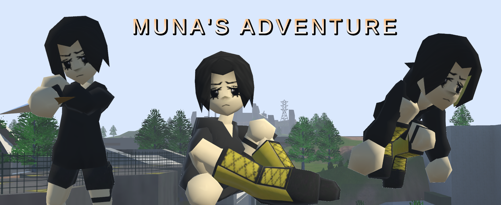

# Muna's Adventure

[Read More About Muna's Adventure](https://portfolium.com/entry/munas-adventure)

_______________________________________

**Muna's Adventure** is a third-person shooter with an emphasis on scavenging items from your environment to increase your chances of survival. The goal of the game is to defeat enemies to progress through the story, using a variety of consumables, plants, rations and ammunition to aid you in your quest!

_______________________________________

I challenged myself to create a fully playable prototype in one year. In that time, I developed an interactable inventory of items, specialized to store a list of instantiated scriptable objects labeled as 'items.' Using the properties of inheritance, sub-items were created that were compatible with the UI Inventory Controller System and still behave in their own unique way such as: ammunition items that reload to and fire from your weapon, or consumable items that can be used in-game to heal the player or provide defensive buffs. Additionally, I crafted all animations and made them with animation masking in mind - allowing us to use the same base animations with alternate arm animations that change depending on the weapon being used. The firing system was made using Unity's particle system with collision enabled. Adjustments to the particle system were made to account for firing speed, ricochets and aim variance - the same bullet asset being used by all firing entities by limiting bullet collision detectiom from the firing entity. Similar to bullets, an explosive grenade was created following the same collision detection properties, however these grenades have the special property of applying forces to rigidbodies in its vicinity. To wrap up the game up, I made cinematic cutscenes to introduce the characters, their immediate goals, and to drop additional information about the world as well.

_______________________________________

**CosmeticController.cs**: Searches through parented objects on player, storing any objects with the tag 'cosmetic.' Once stored, a helper function can use an index to mark a cosmetic as ON and visible. If the player is already wearing cosmetic, the current cosmetic index is disabled and overriden by the new index.

**DropDownFace.cs**: This scipt is linked directly to a dropdown UI list. On Start, a list of selectable cosmetics is generated based on any cosmetic items that were found by CosmeticController. If the player selects a new cosmetic item from the list, the index of selected item is sent to CosemticController where it is enabled.
